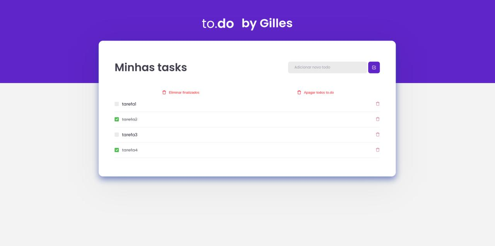

<h1 align="center">🔗 to.Do List</h1>
<p align="center"><a src="https://github.com/Rocketseat">Rocketseat's</a> first challenge on the Ignite React track 🚀 </p>
<figure>
  
</figure>
<div>
  <h2>Abaut the challenge</h2>
   In this challenge, an application was created to train the main concepts of ReactJS on IGNITE by <a src="https://github.com/Rocketseat">Rocketseat's</a>
  <p>This application has as the main objective allow the user to create activities to do.</p>
  
  <h2>Main requirements of the challenge</h2>
  <ul>
    <li>Add a new task</li>
    <li>Remove a task</li>
    <li>Mark and unmark a task as completed</li>
  </ul>
  
   <h2>Incremented requirements</h2>
  <ul>
    <li>Remove all tasks at once</li>
    <li>Remove all completed tasks at once</li>
  </ul>
  
  <h2>Technologies used in the project</h2>
  <ul>
    <li>ReactJS</li>
    <li>TypeScript</li>
    <li>HTML5</li>
    <li>CSS3</li>
    <li>SASS</li>
  </ul>

## 👾 How to run

```bash
# Faça o clone deste repositório para qualquer pasta de sua preferencia
$ git clone https://github.com/Gilles30/desafio-01-trilha-react-ignite

# Vá até essa pasta
$ cd desafio-01-trilha-react-ignite

# rode esses comandos para instalar as dependências (lembrando que deverá ter o node instalado em sua máquina)
$ yarn || npm i

# use esses comandos para rodar o Projeto
$ yarn dev || npm run dev
```

# 👨‍💻 Author

Made with love, care and dedication by **Lorison Gilles!** 🤓 Get in touch!

[](https://github.com/Gilles30)
[](https://www.linkedin.com/in/lorison-gilles/)
[](https://api.whatsapp.com/send?phone=+5511959409168&text=Hello!)
[](mailto:lorison.gilles@gmail.com)

</div>
